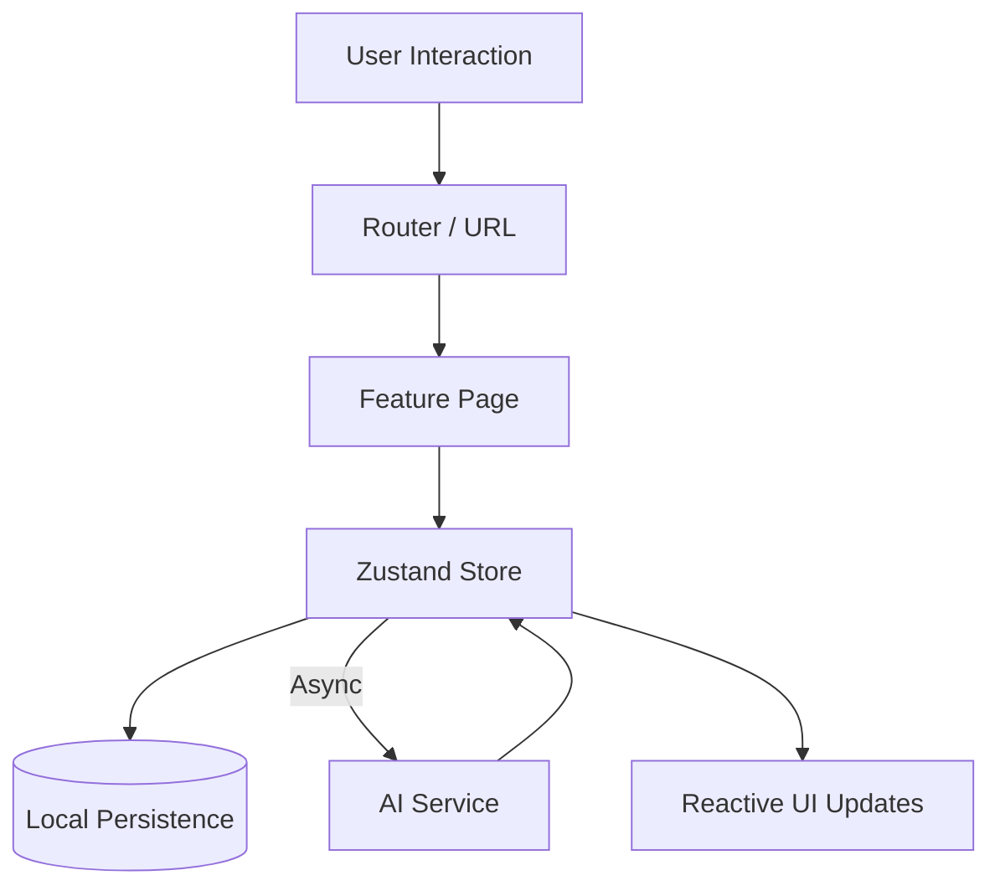

# Architecture Overview

## Current State (As of Feb 2026)

### High-Level Structure

The application is a **Single Page Application (SPA)** built with React and Vite. It currently follows a **Feature-Sliced** directory structure, where distinct domains of the application (Drilldown, Story Studio, Scanner) are encapsulated in `features/`.

### Core Data Model: The Nexus

The central data structure is the **Nexus Graph**, encompassing:

- **Registry**: A flat `Record<string, NexusObject>` serving as the source of truth.
- **NexusObject**: Polymorphic entities acting as Notes, Containers, Stories, or Links.
- **Relationships**:
  - `SimpleLink`: Basic graph edges.
  - `HierarchicalLink`: Structure-defining edges (Parent/Child).
  - `SemanticLink`: Meaning-bearing edges (e.g., "causes", "loves").

### Key Technical Debt & Challenges

1.  **"God Object" State**: The `App.tsx` component holds the entire application state and passes it down via props. This causes unnecessary re-renders and makes deep-linking impossible.
2.  **Hybrid Build System**: The project uses a mix of modern Vite tooling and "no-build" CDN scripts/ImportMaps in `index.html`. This limits performance optimizations and prevents using standard npm ecosystem tools effectively (e.g., Tailwind plugins).
3.  **Ephemeral Storage**: Data exists only in memory (RAM). Refreshing the page destroys the session unless manually exported (simulated).

---

## Target Architecture (Scale-Ready)

### 1. The Core Layer (`src/core`)

- **Domain Entities**: TypeScript definitions for `NexusObject`, `Story`, `Chapter`, decoupled from UI.
- **Stores (State)**: A simplified Flux-like state manager (Zustand) exposing hooks (`useGraph`, `useSelection`).
- **Services**:
  - `StorageService`: Handles saving/loading (IndexedDB/Cloud).
  - `GraphService`: Optimized graph traversal algorithms.
  - `AIService`: Interface for Google GenAI (Gemini) abstraction.

### 2. The Application Layer (`src/app`)

- **Routing**: URL-driven navigation managing the View state.
- **Layouts**: Composable `AppShell` layouts wrapping routes.

### 3. The Feature Layer (`src/features`)

Independent modules that consume Core services. Features should interact with the global store rather than accepting giant prop objects.

- `features/studio`: The creative writing interface.
- `features/graph`: The visual exploration (Drilldown).
- `features/ingestion`: The Scanner/Refinery pipeline.

### 4. The UI System (`src/ui`)

Atomic, reusable implementation of the "Nexus" aesthetic (Tailwind + Framer Motion components).

- `Button`, `Panel`, `Input`
- `ThemeContext` for dynamic switching (Modern/Legacy/Vanilla).

## Data Flow Diagram (Target)

