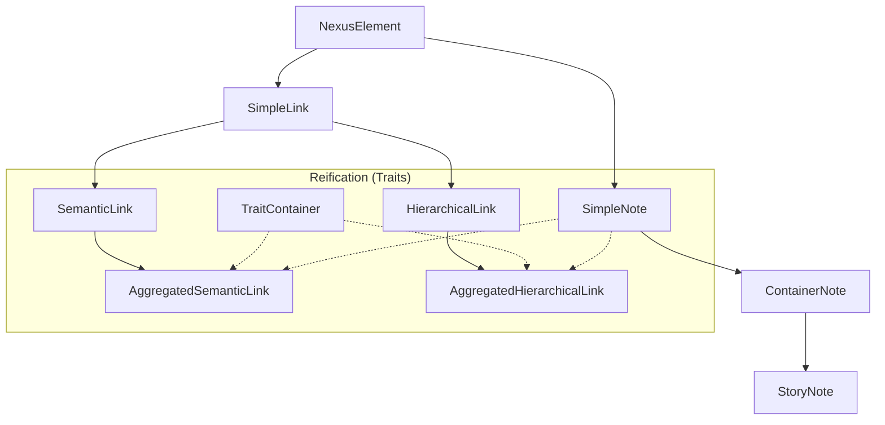

# Ekrixi-AI Data Schemas

This document details the core data structures, type hierarchies, and inheritance patterns used throughout the Ekrixi-AI Knowledge Nexus.

## 1. Core Nexus Hierarchy

All knowledge units and relationships derive from the base `NexusObject`. The system follows a "Trait-based" composition model.

### Base Component: `NexusElement`

The fundamental metadata slab shared by ALL objects in the registry.

```typescript
interface NexusElement {
  id: string;
  internal_weight: number;
  total_subtree_mass: number;
  created_at: string;
  last_modified: string;
  link_ids: string[];
}
```

### Knowledge Units (Notes)

Notes represent conceptual or narrative entities.

- **`SimpleNote`**: A fundamental unit of knowledge.
- **`ContainerNote`**: A note that can hold other units (Implements `TraitContainer`).
- **`StoryNote`**: Specialization of `ContainerNote` for narrative elements (`BOOK`, `CHAPTER`, `SCENE`).

### Relationships (Links)

Links define the associations between knowledge units.

- **`SimpleLink`**: Base relationship.
- **`SemanticLink`**: Associative relationship ("is related to", "interacts with").
- **`HierarchicalLink`**: Structural relationship ("is parent of", "is part of", Implements `TraitHierarchy`).

---

## 2. Reification & Aggregation

Reification is the process of elevating a relationship (Link) into a first-class Knowledge Unit (Note).

- **`AggregatedSemanticLink`**: A reified semantic association.
- **`AggregatedHierarchicalLink`**: A reified structural association.

**Reified Structure**:
When a link is reified, it gains `TraitContainer` capabilities and `SimpleNote` metadata (title, gist, prose), effectively becoming an "Omni-Unit" that bridges two other nodes.

---

## 3. Story Studio Schemas

The Story Studio uses a "Block-based" drafting system called the **Manifesto**.

### `StudioBlock`

Drafting instructions or structural markers.

- **Types**: `THESIS`, `DELTA`, `CONTEXT`, `LATENT_UNIT`, `ORACLE_PROMPT`, `LITERARY_APPROACH`.
- **Data**: Polymorphic record based on the block type.

### `ManifestoBlock` (Registry Node)

When a studio block is committed to the registry for storage in a `StoryNote`.

```typescript
interface ManifestoBlock extends NexusElement {
  _type: 'MANIFESTO_BLOCK';
  block_type: string;
  data: Record<string, any>;
  parent_id: string; // The ID of the Chapter or Scene
}
```

---

## 4. Universe & Chat Schemas

### `Universe`

The top-level container for a project.

```typescript
interface Universe {
  id: string;
  name: string;
  description: string;
  ownerId: string;
  nodeCount: number;
  chatCount?: number;
}
```

### `ChatSession`

A persistent, branching conversation within a universe.

```typescript
interface ChatSession {
  id: string;
  title: string;
  messageMap: Record<string, MessageNode>;
  rootNodeIds: string[]; // Supports multiple starting points
  currentLeafId: string | null;
}
```

### `MessageNode`

A single beat in a branching conversation thread.

```typescript
interface MessageNode {
  id: string;
  role: 'user' | 'model';
  text: string;
  parentId: string | null;
  childrenIds: string[];
  selectedChildId: string | null; // Tracks the active branch
}
```

---

## 5. Composition & Inheritance Patterns

Ekrixi-AI uses a mix of interface inheritance and trait composition to maintain flexibility.

### Inheritance Tree



### Special Unit Types

- **Ghost Notes (`is_ghost: true`)**: Placeholder units derived from the Scanner or references that haven't been fully fleshed out or committed yet.
- **Author Notes (`is_author_note: true`)**: Meta-knowledge units linked to specific story beats, chapters, or characters, often containing drafting reminders.
- **Aggregated Units**: Reified links that store their own prose and metadata while maintaining a bridge between two other units.

---

## 6. Logic vs. Narrative Separation

The schema enforces a strict separation between the "World Registry" (Logic) and the "Story Manifest" (Narrative).

- **Logic Units**: Pure concepts, entities, and structural links.
- **Narrative Units**: `StoryNote` objects which reference Logic Units as "Anchors" but maintain their own sequence and tension metadata.
- **Weaving Protocols**: JSON-based configuration strings stored in notes that define how the LLM should "stitch" together lore bits for specific narrative outputs.

---

## 7. Stored Manifest Structures

### Manuscript Blocks

Stored in `StoryNote.manifesto_data` or as independent `ManifestoBlock` nodes.

- **`THESIS`**: The core thematic goal of a chapter.
- **`DELTA`**: The specific change or event occurring in a scene.
- **`LATENT_UNIT`**: Knowledge units identified as "hidden" or "to be revealed."
