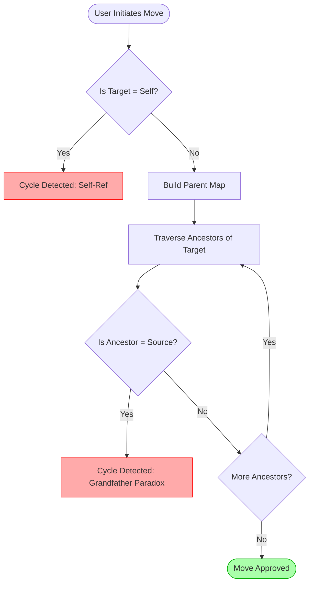

# Graph Integrity Service

The `integrity` feature is the structural foundation of Ekrixi-AI. It ensures that the knowledge graph remains consistent, logical, and traversable.

## Overview

Centered around `GraphIntegrityService.ts`, this feature performs real-time analysis of the knowledge registry to detect cycles, redundancies, and structural implications.

## Key Functions

### 1. Hierarchy Mapping

`buildHierarchyMap` constructs an immediate parent-child link map by inspecting both `children_ids` (TraitContainer) and `HIERARCHICAL_LINK` types (TraitHierarchy).

### 2. Cycle Detection

The `detectCycle` function uses a stack-based traversal to ensure that no path from a target leads back to its source. This is critical for maintaining a Directed Acyclic Graph (DAG) for the world structure.

### 3. Link Integrity Analysis

The `analyzeLinkIntegrity` function categorizes links into one of four statuses:

- **APPROVED**: Structural, reified, or unique semantic links.
- **REDUNDANT**: The connection already exists as a structural element or a direct bridge.
- **IMPLIED**: A multi-step path already connects these units, making the new link a potential "shortcut".
- **CONFLICT**: (e.g., Causal Loops) Links that would break the structural rules of the nexus.

## Structural Rules

- **Hierarchical Immunity**: Links defined as hierarchical are considered "Truth" and are only checked for cycles, never redundancy.
- **Reified Intent**: Explicitly reified links are always approved, as they represent the author's deliberate intent to record a specific relationship.
- **Semantic Priority**: Semantic links are flagged if they mirror an existing hierarchical path to prevent clutter.

## Engineering Architecture

### Cycle Detection Algorithm

The `GraphIntegrityService` employs a Depth-First Search (DFS) strategy to validate structural changes before they are committed. This ensures the graph remains a Directed Acyclic Graph (DAG) for hierarchical relationships.

### Link Validation Matrix

The service uses a matrix to determine the validity of a new link based on existing graph topology.

| Existing Path       | New Link Type | Result Status | Reason                                     |
| :------------------ | :------------ | :------------ | :----------------------------------------- |
| None                | Semantic      | `APPROVED`    | New knowledge connection.                  |
| None                | Hierarchical  | `APPROVED`    | New structural parentage.                  |
| Direct (Same)       | Semantic      | `REDUNDANT`   | Connection already exists.                 |
| Indirect (Ancestor) | Semantic      | `IMPLIED`     | Ancestor already covers this relationship. |
| Reverse Path        | Hierarchical  | `CYCLE`       | Would create an infinite loop.             |
