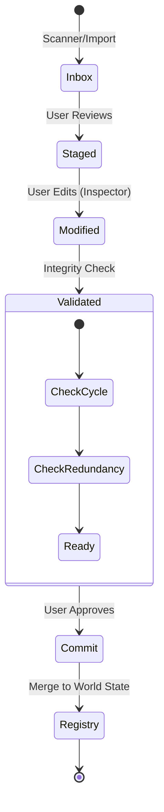

# Lore Refinery

The `refinery` feature is the staging area for incoming information. It allows users to process, clean, and organize extracted data before committing it to the permanent world registry.

## Overview

`RefineryFeature.tsx` acts as an "Inbox" for batches of data coming from the Scanner, Import services, or the Generator. It provides a non-destructive environment to test structural changes.

## Functional Areas

### 1. Batch Inbox

Displays all pending batches with their status (`pending`, `processed`, `committed`). Each batch shows its item count and source metadata.

### 2. Hierarchy Explorer (H-Tree)

A sidebar-mounted tree view for rapid organization. Supports:

- **Reparenting**: Drag and drop reorganization with instant cycle detection.
- **Unit Deletion**: Pruning unnecessary extractions.
- **Logical Promotion**: Adding sub-units directly to existing nodes.

### 3. Oracle (Drilldown View)

A visualizer mode used for inspecting the relationships within a batch. It enables "Scrying" into the conceptual map to see how new units will fit into the existing web.

### 4. Refinery Inspector

A detailed editing panel for individual units. Users can update:

- Titles and Gists.
- Prose content and metadata.
- Categories and tags.

## Core Operations

- **Commit to Registry**: The final step where refined units are moved into the main world state.
- **Reification**: Similar to the Drilldown feature, refinery allows promoting links into logical units during the staging phase.
- **Integrity Shield**: All refinery operations are monitored by the Graph Integrity Service, providing real-time feedback on structural health.
- **Add Child**: Allows the user to "promote" a leaf node into a container by adding a sub-unit, automatically upgrading its type.

## Engineering Architecture

### Unit Lifecycle

The Refinery acts as a state machine for new knowledge units, ensuring they are valid before entering the permanent registry.

### Reification Logic

Reification is the process of converting a `SimpleLink` (Edge) into a `NexusObject` (Node) while maintaining the connection logic.

1.  **Selection**: User selects a link between Node A and Node B.
2.  **Promotion**: System creates a new `CONTAINER_NOTE` (Node R).
3.  **Rewiring**:
    - Link A->B is deleted.
    - Link A->R is created (Hierarchical or Semantic).
    - Link R->B is created (Hierarchical or Semantic).
4.  **Preservation**: Metadata from the original link (verb, strength) is preserved in the new Node R.
