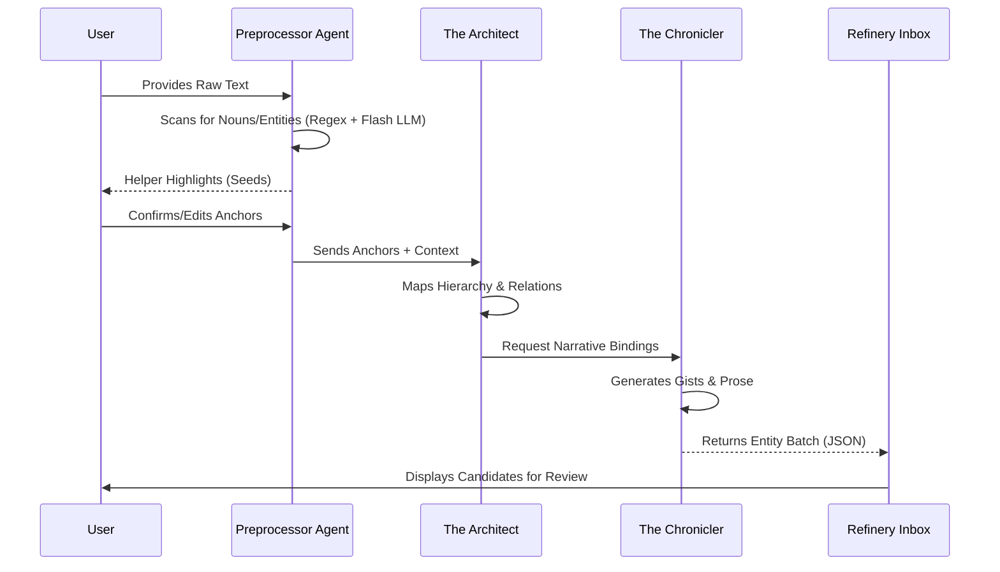

# AI Scanner (Lore Extraction)

The `scanner` feature provides powerful AI-driven extraction of knowledge from unstructured text, transforming raw lore into standardized nexus units.

## Overview

`ScannerFeature.tsx` orchestrates a multi-staged pipeline that uses high-end LLM agents to reconcile text with the existing world graph.

## Extraction Stages

1.  **INPUT**: User provides raw text (pasted or imported).
2.  **PREPROCESS**: The "Preprocessor Agent" identifies potential nouns, entities, and conceptual anchors within the text to create "seeds".
3.  **PROCESSING**: The "Architect" and "Chronicler" agents analyze the seeds and context to:
    - Identify hierarchy (Part-of relationships).
    - Identify associations (Semantic relationships).
    - Extract concise gists and detailed records.
4.  **REVIEW**: A side-by-side reconciliation interface where the user can inspect extracted units, resolve conflicts, and commit the batch to the Refinery.

## Core Agents

- **The Architect**: Responsible for mapping the structural JSON output. It identifies hierarchical vs semantic links and proposes content for each entity.
- **The Chronicler**: Responsible for binding relationships and ensuring and narrative consistency during the extraction.

## Structural Rules

Every extracted link is analyzed by the `GraphIntegrityService`. Conflicts are flagged with status indicators (`REDUNDANT`, `IMPLIED`, `CYCLE`) to ensure the user doesn't inject structural errors into the registry.

## Engineering Architecture

### Extraction Pipeline

The scanner utilizes a multi-agent system to progressively refine raw text into structured data.



### Data Transformation

Units pass through three distinct states during the scanning process:

1.  **Raw Text**: Unstructured string data.
2.  **Entity Seed**: A lightweight object containing only a title, type, and source index.
    ```typescript
    interface EntitySeed {
      id: string;
      title: string;
      category: NexusCategory;
      aliases: string[];
    }
    ```
3.  **Candidate Node**: A fully formed `NexusObject` with provisional IDs, waiting in the Refinery.
