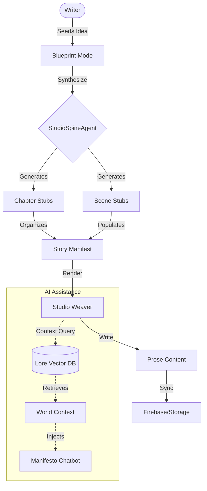

# Story Studio

The `story-studio` feature is the creative heart of Ekrixi-AI, where world-building meets narrative craftsmanship. It provides a specialized environment for writing manuscripts while staying anchored in the world's lore.

## Overview

The feature is split into two primary operational modes: **Blueprint** and **Spine**. It is managed by the `StoryStudioFeature.tsx` component and the comprehensive `useStoryStudio` hook.

## Operational Stages

### 1. Blueprint Mode

In this stage, users defined the structural "Manifold" of their story.

- **Story Bookends**: Managing the beginning and end of narrative arcs.
- **Block Management**: Creating high-level chapters and scenes.
- **Lore Context**: Linking blocks to existing wiki units.

### 2. Spine Mode

The active writing and narrative management phase.

- **Studio Spine**: A vertical manifestation of the story flow.
- **Chapter/Scene Zoom**: Focused writing environments for individual units.
- **Composite Weave**: AI-assisted drafting where the chatbot can directly interact with the manuscript.

## Key Functional Widgets

- **Lore Scryer**: A searchable library of the world registry available during writing.
- **Authors Notes**: Chapter-specific notes for meta-commentary and drafting reminders.
- **Manifesto Chatbot**: An integrated AI assistant for brainstorming, outlining, and drafting.
- **Manuscript Gallery**: Management of multiple books/projects.

## Technical Details

- **Syncing Protocol**: Automatic background saving (`Syncing Protocol...`) ensures work is never lost.
- **Export/Import**: Stories can be exported as "Blueprints" (JSON) for backup or sharing.
- **Lore Integration**: Direct linking between narrative beats and the knowledge nexus.

## Engineering Architecture

### Studio Data Flow

The Story Studio orchestrates a complex flow of data between the high-level Blueprint and the granular Scene content.

### Agent Modes

The `StudioSpineAgent` supports three operational modes for maximum flexibility and privacy:

1.  **Direct API**: Browser directly calls Google Gemini API (Key in local storage).
2.  **Backend Proxy**: Calls routed through `api/generate-text` (Community Key / Rate Limited).
3.  **Local LLM**: Calls routed to `localhost:11434` (e.g., Ollama) for offline drafting.
