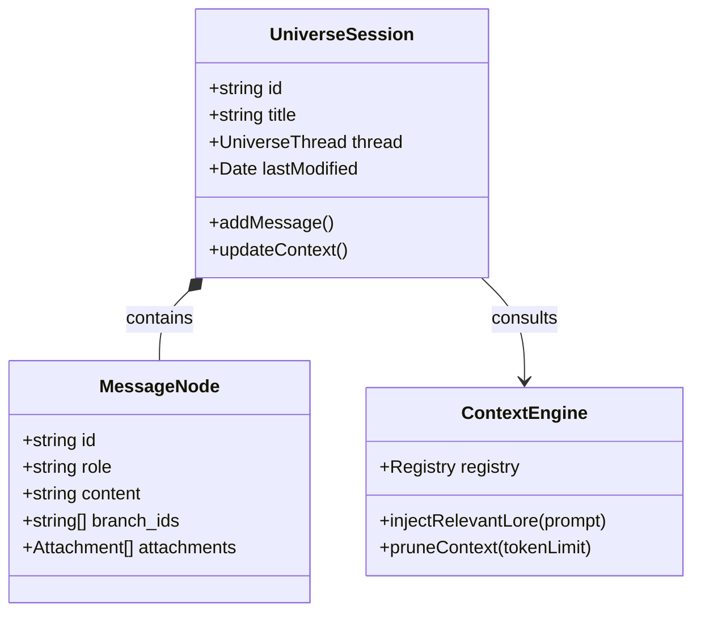

# Universe Generator

The `universe-generator` is a conversational AI interface designed for multi-session world-building. It acts as a brainstorming partner that helps users manifest their ideas into structured lore.

## Overview

`UniverseGeneratorFeature.tsx` provides a modern chat experience optimized for long-form world development. It leverages persistent sessions to maintain a history of the project's evolution.

## Core Interface

- **Sidebar**: A management console for session history, permitting renaming, deletion, and quick creation of new threads.
- **Message List**: A fluid, branchable chat history where AI responses are displayed.
- **Composer**: A specialized input area for sending prompts. It is "lore-aware," meaning it has context from the current world registry.

## Functional Capabilities

### 1. Session Management

Uses the `useUniverseChat` hook to maintain state across sessions. Each session has a unique ID, title, and message thread stored in the local repository.

### 2. Lore Awareness

When the AI generates ideas, it considers the current units in the registry (e.g., existing characters, locations, laws of physics).

### 3. Direct Refinement

AI-generated text can be directly sent to the Scanner/Refinery for extraction, bridging the gap between "Generative Chat" and "Structured Registry."

## Aesthetic & UX

- **Glassmorphism**: Utilizes backdrop-blur and semi-transparent panels for a high-tech "Oracle" feel.
- **Branching Navigation**: Supports navigating through multiple versions of a response (Branching Threads).
- **Responsive Layout**: Includes a mobile-optimized drawer for session management.

## Developer Notes

The generator interacts with the `GEMINI_MODELS` defined in the core LLM package. It uses specialized system instructions to maintain its persona as a "World Building Architect."

## Engineering Architecture

### Chat Session Anatomy

The Universe Generator maintains a persistent, context-aware state for each conversation thread.

### State Management

The `useUniverseChat` hook manages the complex state of a branching conversation.

- **Thread Linearization**: While the data structure supports branching trees of messages, the hook "linearizes" the current path for the UI render.
- **Optimistic Updates**: Use input is immediately rendered while the "Thinking" state engages the `ContextEngine` to prepare the LLM payload.
